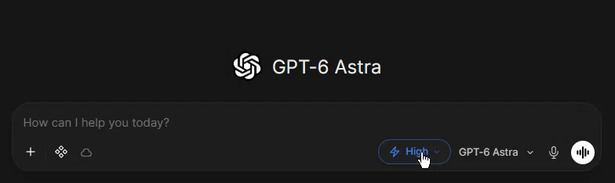

#### DISCLAIMER: this project was created with the assistance of an LLM. Although major parts of the code was generated, it was entirely reviewed and tested by a human. Also this project wouldn't exist without the contribution of CryptoSharon, please see the credits section.
---
# Reasoning Effort Selector for Open WebUI

**A patch for [Open WebUI](https://github.com/open-webui/open-webui) that adds a ChatGPT-style *reasoning effort* selector, integrated natively into the application with a simple file mount, or client side as a browser extension**

> The same script can be deployed in two ways: as a **native patch** mounted into the container (recommended: works on every device, phone included, with nothing to install client-side) or as a **userscript** via Violentmonkey. Jump straight to [Installation](#installation).



## Table of contents

1. [What is it](#what-is-it)
2. [How it works](#how-it-works)
3. [Installation](#installation)
   - [Method A - native patch (Docker mount)](#method-a)
   - [Method B - userscript (Violentmonkey)](#method-b)
   - [Recommended - the `re-registry` function](#re-registry)
4. [Usage](#usage)
5. [FAQ](#faq)
6. [Credits](#credits)
7. [License](#license)

---

<a id="what-is-it"></a>
## What is it

A **per-model reasoning effort selector**: a compact ⚡ pill in the input bar (desktop) and a trigger in the top navbar (mobile), with a popup to pick between the levels **None / Minimal / Low / Medium / High / X-High / Max** — or a simple Think On/Off switch for models without discrete levels.

- **Native patch (Docker mount)** — the script is served by Open WebUI itself, at every startup, for all users and devices. **No extension required.** → [Docker Mount](#method-a)
- **Userscript (Violentmonkey)** — the script runs in the browser of whoever installs it. Handy for quick trials, but must be installed on every client. → [Browser Extention](#method-b)

Repository contents:

| File | Role |
|---|---|
| `openwebui-reasoning-effort.user.js` | The widget script (identical for both install methods) |
| `main.py` | Optional **`re-registry`** function for Open WebUI (per-model registry) |

---

<a id="how-it-works"></a>
## How it works

**Deployment side.** Open WebUI ships the tag `<script src="/static/loader.js" defer crossorigin="use-credentials"></script>` in its own HTML: that is the extension point meant for custom JavaScript. On every startup the backend wipes and re-copies the contents of `/app/build/static/` into the directory that is actually served under `/static/*`. Mounting our script as `/app/build/static/loader.js` makes Open WebUI serve it natively on every boot and after every update — the only requirement is that the mount survives container recreation.

**Runtime side.** Once running in the browser, the script:

- detects the Open WebUI interface and keeps listening (MutationObserver) on both desktop and mobile;
- hooks `fetch` and injects **`think`** (Ollama backends) or **`params.reasoning_effort`** (other compatible backends) into chat request bodies;
- detects each model's capabilities, in priority order:
  1. the registry pipe (see the `re-registry` function [below](#re-registry)),
  2. Ollama auto-detection via `/ollama/api/show` (think on/off or named levels),
  3. efforts learned from previous backend error messages,
  4. model metadata (`reasoning.supported_efforts`),
  5. a public database (OpenRouter model specs, cached 24 hours in `localStorage` - https://openrouter.ai/api/v1/models);
- stores the selection **per model** in `localStorage`: switching models restores that model's level;
- **Default** sends no override at all (the widget renders muted);
- levels not verified for the selected model stay selectable, but are flagged with a warning icon.

---

<a id="installation"></a>
## Installation

<a id="method-a"></a>
### Method A - native patch (Docker mount)

1. Copy the contents of `openwebui-reasoning-effort.user.js` to a persistent path reachable by your deployment
2. Add a bind mount to the container configuration:
   - `<your-path>/openwebui-reasoning-effort.user.js:/app/build/static/loader.js:ro`
4. Recreate the stack
5. Verify: open `https://your-openwebui-domain/static/loader.js` - it must show the script.

<a id="method-b"></a>
### Method B - userscript (Violentmonkey)

Useful if you cannot (or prefer not to) touch the container configuration, or for quick testing. Applies only to the browser you install it in.

1. Install a userscript manager: [Violentmonkey](https://violentmonkey.github.io/), [Tampermonkey](https://www.tampermonkey.net/) or [Greasemonkey](https://greasespot.net/).
2. Open the manager → **Create a new script** → paste the entire contents of `openwebui-reasoning-effort.user.js` over the template → save.
3. Open Open WebUI: the widget appears in the input bar (desktop) and in the top navbar (mobile).

<a id="re-registry"></a>
### Recommended - the `re-registry` function (per-model registry)

Although the script works fine **without** this component (it relies on the automatic detections), it is HIGHLY RECOMMENDED to install this small pipe: a small fake "model" that only answers the script's automatic registry ping with your own JSON registry of models.

1. In Open WebUI: **Admin Panel → Functions** → **+ Create a Function**.
2. Paste the entire contents of `main.py` into the editor.
3. Set an **ID that contains `re-registry`** (e.g. `re_registry`).
4. Save and enable the function with the **Active** toggle. It appears in the model list as "re-registry …": **don't select it in a chat**, it is not a real model and you can even hide it in the models list if you want.
5. Open the **Valves** (⚙️ on the function row) and fill the `registry` field: a JSON object mapping the **exact model ids** (as shown in *Admin Panel → Settings → Models*) to their capabilities:

```json
{
  "deepseek-v4.1-flash": { "thinking": true, "levels": true, "efforts": ["none", "minimal", "low", "high", "max"] },
  "gpt-6-astra": { "thinking": true, "levels": true, "efforts": ["low", "medium", "high", "xhigh", "max"] },
  "qwen-3-5-9b": { "thinking": true, "levels": false, "efforts": [] },
  "llama-2": { "thinking": false, "levels": false, "efforts": [] }
}
```

- `thinking: false` → hides the widget for that model;
- `levels: false` → shows a simple Think On/Off switch instead of the slider;
- `efforts` → allowed levels, chosen from: `none, minimal, low, medium, high, xhigh, max`.

Save and reload the page: the registry is fetched once per session and takes top priority.

---

<a id="usage"></a>
## Usage

- Click the **⚡ pill** in the input bar (or the navbar trigger on mobile) to open the popup.
- Click the **level title** to open the full level list; the reset button (or the **Default** entry) clears the override.
- The choice is **per model** and persists in the browser (`localStorage`): switching models restores the associated level.
- A ⚠️ icon on a level means it is not verified for that model (still selectable).
- On Ollama, unsupported named levels are rounded **down to the nearest supported one**; for models without discrete levels the widget becomes a Think On/Off switch.

---

<a id="faq"></a>
## FAQ

<details>
<summary><strong>The widget does not appear after updating the file or restarting the app.</strong></summary>

Almost always the browser cache keeps serving the old copy of `/static/loader.js`. Hard-refresh (Ctrl/Cmd+Shift+R). If it persists, open `https://your-domain/static/loader.js` and check that the content is up to date and complete (it must end with `})();`).

</details>

<details>
<summary><strong>Is the <code>re-registry</code> function mandatory?</strong></summary>

No. The script detects capabilities on its own (Ollama, model metadata, learned efforts, public database). The function exists only for explicit, reliable control over specific models (see [above](#re-registry)).

</details>

<details>
<summary><strong>Can I keep the native patch and the extension active at the same time?</strong></summary>

Yes, there is no conflict: the second instance detects the first one already loaded and exits immediately.

</details>

<details>
<summary><strong>Does it work on mobile / behind a reverse proxy?</strong></summary>

Yes, with Method A: the script is served by Open WebUI itself, so it applies to every client without extensions. With Method B it depends on the extension installed in each client's browser.

</details>

<details>
<summary><strong>Why are some levels marked with a warning icon?</strong></summary>

That level was not verified for the selected model by any trusted source; you can still select it. Verify against your backend before trusting it.

</details>

<details>
<summary><strong>My backend does not support <code>params.reasoning_effort</code> — what does it receive?</strong></summary>

Ollama receives `think` (rounded down if a named level is unsupported); other backends receive `params.reasoning_effort`. If the backend ignores it, it simply has no effect.

</details>

<details>
<summary><strong>Does an Open WebUI update break anything?</strong></summary>

The mount survives updates and the script is re-deployed at every startup. If a future version changes the DOM elements the widget hooks into, update `openwebui-reasoning-effort.user.js` with the new version.

</details>

<details>
<summary><strong>How do I uninstall?</strong></summary>

Method A: remove the mount entry from the app configuration and restart. Method B: delete the script from the userscript manager.

</details>

---

<a id="credits"></a>
## Credits

This project is based on the original work of **[CryptoSharon](https://gist.github.com/CryptoSharon)**:

- **[Reasoning Effort addon for OpenWebUI](https://gist.github.com/CryptoSharon/a8590ce5663926a0bf37ef4ec8429b2c)** — the original userscript and the idea of the native integration (in the gist: `reasoning-effort.js`, `patch-startup.sh` and `docker-compose.yml`, which inject the script at startup by rewriting `index.html`).
- This version is a rewrite/extension of it: more capability-detection sources, the `re-registry` function, a reworked UI, and a native install method **without an entrypoint patch** (mount at `/app/build/static/loader.js`).

Thanks to the [Open WebUI](https://github.com/open-webui/open-webui) community.

---

<a id="license"></a>
## License

MIT — see [LICENSE](./LICENSE).

Based on the original work by CryptoSharon: the original contribution remains © its respective author and is republished here with attribution — see [Credits](#credits).
